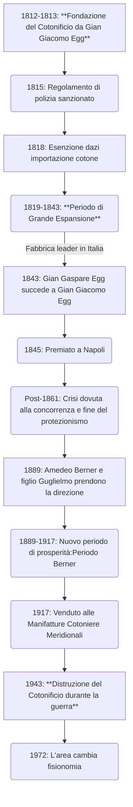

## Mappe antiche di Piedimonte 

Sto portanto avanti per hobby un progetto di registrazione di antiche mappe di [Piedimonte Matese](https://it.wikipedia.org/wiki/Piedimonte_Matese), in particolare riferito all'antico Cotonificio ora demolito.

Il compito non é per nulla facile, a casua dei sistemi di riferimento usati nelle mappe e dei punti di ancoraggio, edifici o luoghi naturali, esistenti nelle mappe e tutt'ora localizzabili.

Queste mappe mappe un modo per mostrare questo lavoro e avere aiuto.

- [Mappa](map.html)
- [Mappa Sotterraneo](map_underground.html) : dati del sotterraneo scoperto e mappato da me ed amici negli anni 90. Sospetto siano sotterranei dell'ultimo cotonificio. La mappatura é alquanto inaccurata.

Sono aperto a qualsiasi informazione,cooperazioni o foto riguardo alla struttura del cotonifio.

Contattatemi a kidpixo [at] gmail.com o cercatemi su qualsiasi piattaforma come kidpixo.

La mappa del **1884** proviene prese dal libro ["Il cotonificio Egg di Piedimonte d'Alife"](https://drive.google.com/file/d/1h53BRzBEh_saqBUhcvaPWc-PPpT_DO9n/view?usp=drive_link) del Gruppo Memorie Storiche di Piedimonte Matese.
Il libro é stato digitalizzato e disponibile qui, previo consenso degli autori che sono riustico a contattare.
Gli autori dei rispettivi capitoli conservano tutti i diritti.
La versione nella [mappa](map.html) é stata artificialmente ingrandita grazie alla AI, a scapito di perdere le scritte.
Versione [originale](images/1884.jpg) e [scalata](1884_enanched.jpg).

La mappa 1964 é stata trovata da Daniela Mastrolorenzo nella Biblioteca comunale di Piedimonte Matese, ringrazio vivamente per le foto.

## Sperimentale

- [Realtá aumentata](ar.html)
- site : [kidpixo.github.io/leaflet-test](https://kidpixo.github.io/leaflet-test)
- repo : [github.com/kidpixo/leaflet-test](https://github.com/kidpixo/leaflet-test)
